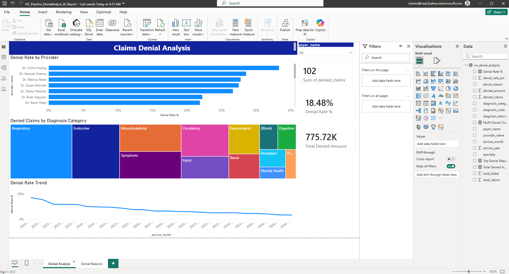
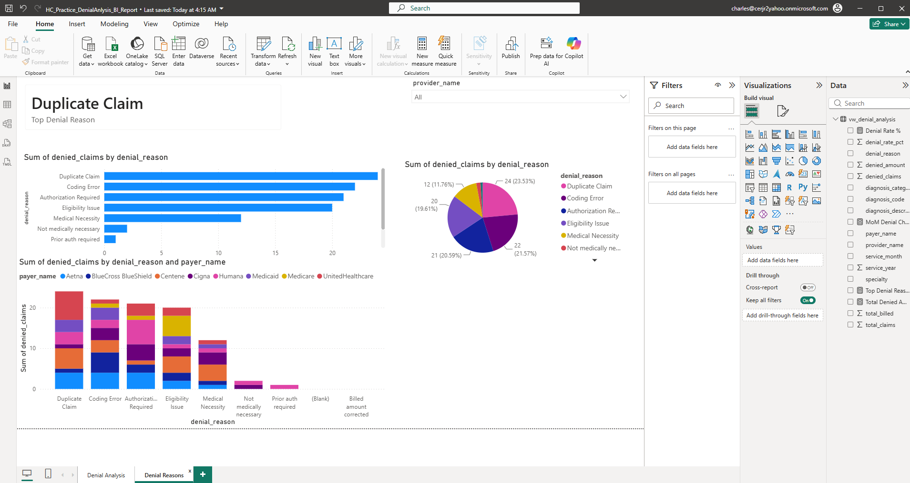
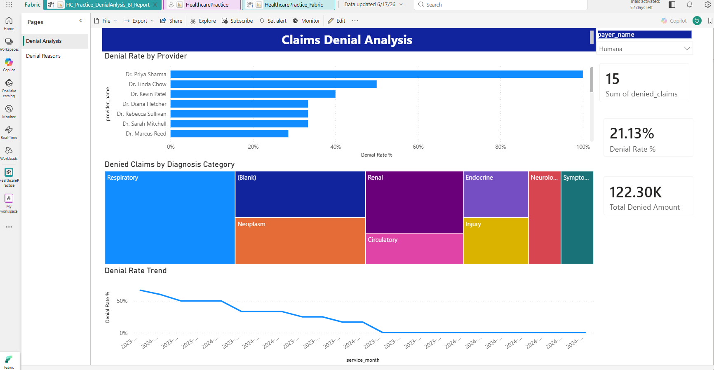
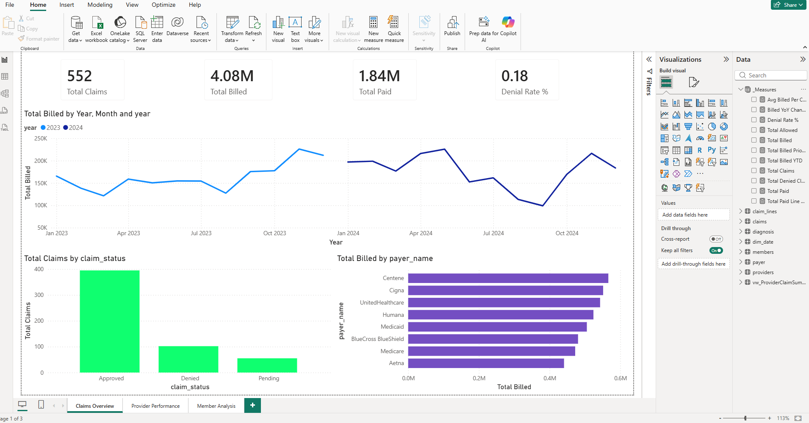
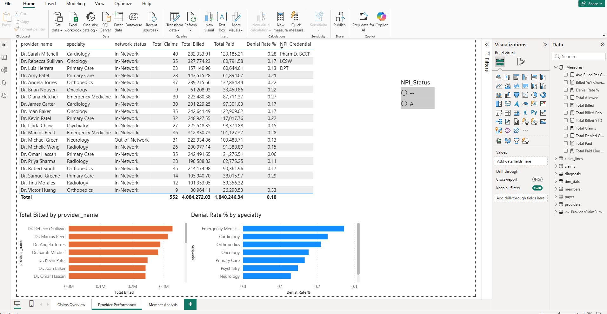
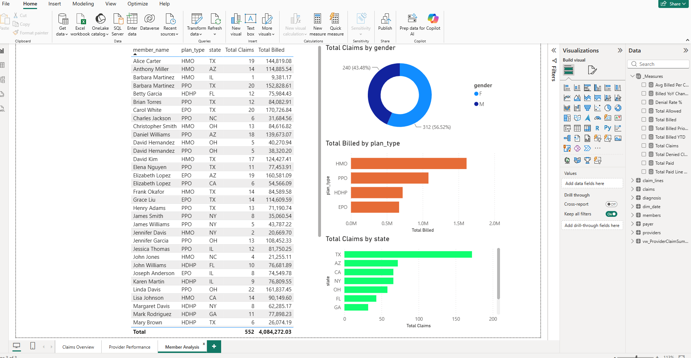
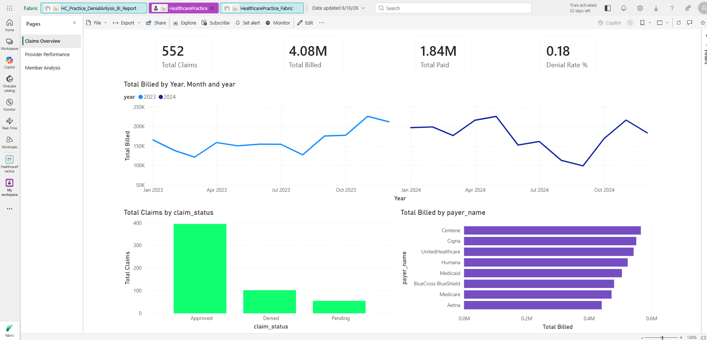

# Power BI Reports — HealthcarePractice

Two published reports in the `HealthcarePractice` Fabric workspace, built on top of the Azure SQL Database source via Import mode.

---

## Report 1 — HC_Practice_DenialAnalysis_BI_Report

**Status:** ✅ Complete — Published to Fabric workspace
**Pages:** 2 (Denial Analysis, Denial Reasons)
**Source:** `dbo.vw_denial_analysis` via Fabric SQL endpoint

### Pages

**1. Denial Analysis**
- Denial Rate by Provider (horizontal bar chart)
- Denied Claims by Diagnosis Category (treemap)
- Denial Rate Trend over time (line chart)
- KPI cards: Sum of Denied Claims, Denial Rate %, Total Denied Amount
- Payer name slicer for cross-filtering

**2. Denial Reasons**
- Sum of denied_claims by denial_reason (bar chart)
- Denial reason distribution (donut chart)
- Denied claims by denial_reason and payer_name (stacked bar)
- Provider name dropdown slicer

### DAX Measures

| Measure | Logic |
|---|---|
| `Denial Rate %` | Denied claims ÷ total claims |
| `Total Denied Amount` | SUM of billed amount where claim is denied |
| `MoM Denial Change` | Month-over-month change in denial volume |
| `Top Denial Reason` | `FIRSTNONBLANK` + `TOPN` — surfaces leading denial reason dynamically |

### Key Findings

- **Duplicate Claim** is the top denial reason — 24 denials (23.5% of all denials). An operational submission issue, not a clinical or coding problem.
- **Coding Error** is the second-leading cause — 22 denials (21.6%).

### Live Report

🔗 **[View Interactive Report in Microsoft Fabric](https://app.fabric.microsoft.com/links/MhZdbtvaK5?ctid=8fedba72-8759-44af-bedb-7ef18463552a&pbi_source=linkShare&bookmarkGuid=dfce8455-987c-4cfc-bccc-87bfaf41c78f)**

### Screenshots





### How it was built

1. Base denial query and aggregation query written and debugged in SSMS
2. `dbo.vw_denial_analysis` created in SQL Server, mirrored as a named query in the Fabric SQL endpoint
3. Power BI Desktop connected via Import mode (Direct Lake doesn't support views — see [`docs/architecture.md`](../docs/architecture.md))
4. DAX measures authored and formatted at the measure level
5. Visuals built, slicers added, report published to Fabric workspace

---

## Report 2 — HealthcarePractice (Multi-Page Claims & Provider Report)

**Status:** ✅ Complete — Published to Fabric workspace
**Pages:** 3 (Claims Overview, Provider Performance, Member Analysis)
**Source:** Azure SQL Database — all core tables via Import mode

### NPI Registry API Integration

This report includes a **live REST API integration** with the CMS NPI Registry (`npiregistry.cms.hhs.gov/api`) built in Power Query M.

A custom M function (`fnGetNPIData`) was written to call the NPI Registry API for each provider, passing the NPI number and returning enriched provider data:

```
= (npi_number as text) =>
let
    url = "https://npiregistry.cms.hhs.gov/api/?version=2.1&number=" & npi_number,
    source = Json.Document(Web.Contents(url)),
    results = source[results],
    hasResults = List.Count(results) > 0,
    firstResult = if hasResults then results{0} else null,
    basic = if hasResults then firstResult[basic] else null,
    taxonomies = if hasResults then firstResult[taxonomies] else {},
    firstTaxonomy = if List.Count(taxonomies) > 0 then taxonomies{0} else null,
    addresses = if hasResults then firstResult[addresses] else {},
    filteredAddresses = List.Select(addresses, each _[address_purpose] = "LOCATION"),
    locationAddress = if List.Count(filteredAddresses) > 0 then filteredAddresses{0} else null,
    credential = if basic = null then null else Record.FieldOrDefault(basic, "credential", null),
    status   = if basic = null then null else Record.FieldOrDefault(basic, "status", null),
    city     = if locationAddress = null then null else Record.FieldOrDefault(locationAddress, "city", null),
    state    = if locationAddress = null then null else Record.FieldOrDefault(locationAddress, "state", null),
    specialty = if firstTaxonomy = null then null else Record.FieldOrDefault(firstTaxonomy, "desc", null)
in
    [
        NPI_Credential = credential,
        NPI_Status     = status,
        NPI_City       = city,
        NPI_State      = state,
        NPI_Specialty  = specialty
    ]
```

The function was invoked against the `providers` table, expanding the NPI API response into five new columns (`NPI_Credential`, `NPI_Status`, `NPI_City`, `NPI_State`, `NPI_Specialty`) merged alongside the existing provider records. This enriches provider data with real, live credentialing information from the national NPI database.

**Why this matters:** The NPI Registry is the authoritative source for provider credentialing in the US healthcare system. Integrating it directly into Power BI via API removes the need to maintain a separate provider reference file and ensures credentials and taxonomy classifications are always sourced from CMS.

### Pages

**1. Claims Overview**
- KPI cards: 552 Total Claims, $4.08M Total Billed, $1.84M Total Paid, 0.18 Denial Rate %
- Total Billed by Year, Month and Year (line chart — 2023 vs 2024 comparison)
- Total Claims by claim_status (bar chart: Approved, Denied, Pending)
- Total Billed by payer_name (horizontal bar chart)

**2. Provider Performance**
- Full provider table with: specialty, network_status, total claims, total billed, total paid, denial rate %, NPI_Credential (from API)
- Total Billed by provider_name (bar chart)
- Denial Rate % by specialty (bar chart)
- NPI_Status slicer

**3. Member Analysis**
- Member detail table: member_name, plan_type, state, total claims, total billed
- Total Claims by gender (donut chart)
- Total Billed by plan_type (bar chart — HMO, PPO, HDHP, EPO)
- Total Claims by state (bar chart)

### Live Report

🔗 **[View Interactive Report in Microsoft Fabric](https://app.fabric.microsoft.com/links/wAjvlTxf5t?ctid=8fedba72-8759-44af-bedb-7ef18463552a&pbi_source=linkShare)**

### Screenshots






### How it was built

1. Power BI Desktop connected to Azure SQL Database via Import mode
2. Custom M function `fnGetNPIData` written in Power Query Advanced Editor
3. Function invoked against `providers` table — NPI number passed per row, API response expanded and merged
4. NPI-enriched provider columns (`NPI_Credential`, `NPI_Status`, `NPI_City`, `NPI_State`, `NPI_Specialty`) added to data model
5. DAX measures built for claims KPIs, denial rate, billed/paid aggregations
6. Three-page report built with cross-filtering slicers
7. Report published to HealthcarePractice Fabric workspace
