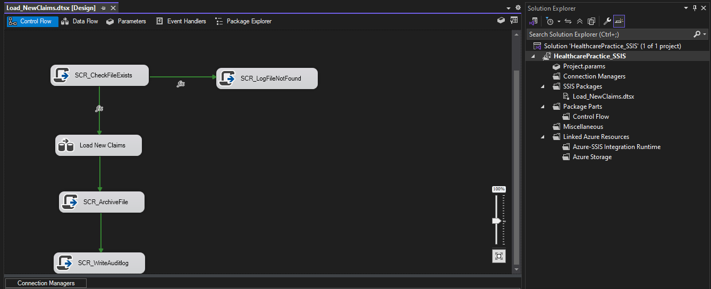
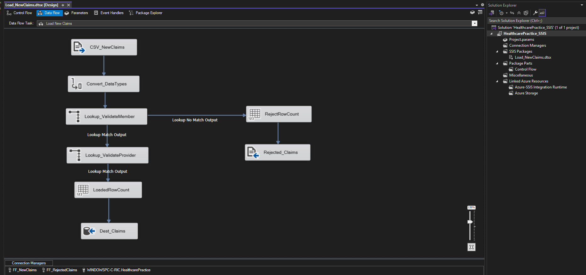

# ETL Pipeline — SSIS

**Tool:** SQL Server Integration Services (SSIS), developed in Visual Studio
**Deployment:** Integration Services Catalogs on both the local SQL Server instance and the Azure SQL Database instance

## Package: Load_NewClaims

### Control Flow

### Data Flow

## Files

| File | Description |
|---|---|
| [`Load_NewClaims.dtsx`](Load_NewClaims.dtsx) | SSIS package file |
| [`LoadNewClaims_Control_Flow.PNG`](LoadNewClaims_Control_Flow.PNG) | Control flow screenshot |
| [`LoadNewClaims_Data_Flow.PNG`](LoadNewClaims_Data_Flow.PNG) | Data flow screenshot |
